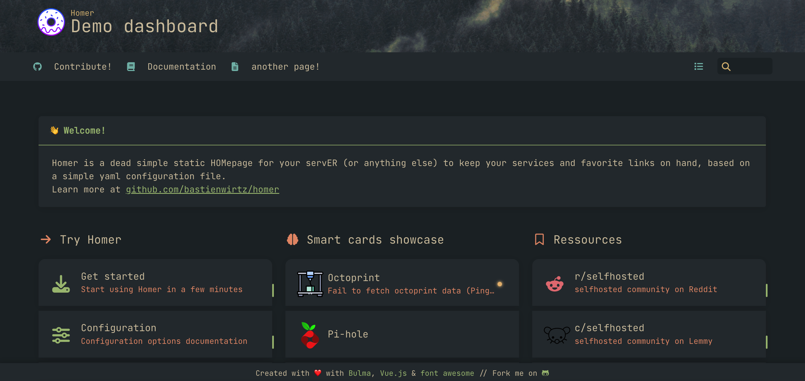

# Everforest-Homer
Inspired by the [Everforest](https://github.com/sainnhe/everforest) theme. This is my take on bringing Everforest to the [Homer Dashboard](https://github.com/bastienwirtz/homer).

Thanks to the [Catppuccin Theme for Homer](https://github.com/mrpbennett/catppuccin-homer) which helped a lot to understand how themes for Homer work.



## Installation

- Copy the files from [`theme`](./theme) over to
  `www/assets/...`
- Put these lines into `www/assets/config.yml` and save the file:

```yaml
stylesheet:
  - 'assets/stylesheet.css'
```

## License

<p align="center"><a href="https://github.com/thorstenstoehr/everforest-homer/blob/main/LICENSE"></a></p>
